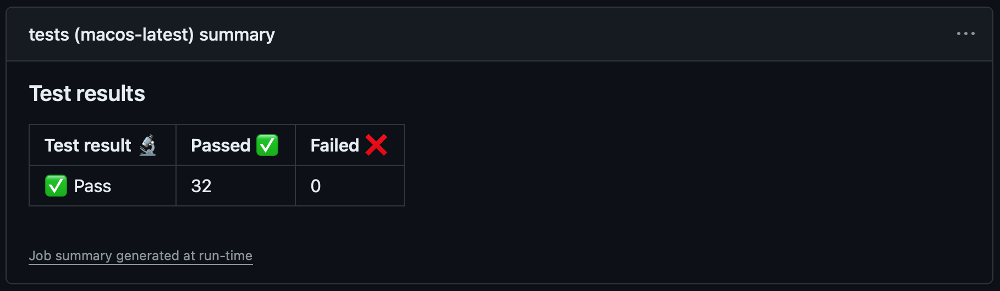

# fish-shop/run-fishtape-tests

[](https://github.com/fish-shop/run-fishtape-tests/actions) [](https://github.com/fish-shop/run-fishtape-tests/issues) [](https://github.com/fish-shop/run-fishtape-tests/network/dependencies) [](https://opensource.org/licenses/mit-license.php) [](https://fishshell.com)

A GitHub action for running [Fishtape](https://github.com/jorgebucaran/fishtape) tests.

<hr>

Here's an example from the test workflow for [Pond](https://github.com/marcransome/pond):


## Prerequisites

This action requires [fish shell](https://fishshell.com). You can install it using the [fish-shop/install-fish-shell](https://github.com/fish-shop/install-fish-shell) action.

## Usage

Add a `uses` step to your GitHub [workflow](https://docs.github.com/en/actions/reference/workflow-syntax-for-github-actions) as shown below:

```yaml
- name: Run Fishtape tests
  uses: fish-shop/run-fishtape-tests@v2
```

By default, all files under `$GITHUB_WORKSPACE` with a `.fish` file extension are tested. To override the default behaviour, provide one or more space-separated pattern values to the `patterns` input. For example, to test all `.fish` files starting in the `tests` directory and descending into subdirectories:

```yaml
- name: Run Fishtape tests
  uses: fish-shop/run-fishtape-tests@v2
  with:
    patterns: tests/**.fish
```

Each pattern value may include [wildcards](https://fishshell.com/docs/current/language.html#expand-wildcard) and/or [brace expansion](https://fishshell.com/docs/current/language.html?highlight=brace+expansion#brace-expansion):

```yaml
- name: Run Fishtape tests
  uses: fish-shop/run-fishtape-tests@v2
  with:
    patterns: tests/*.fish fixtures/**.fish {dir1,dir2}/**.fish ???-*.fish
```

> [!IMPORTANT]
> The `?` wildcard character is [deprecated](https://fishshell.com/docs/current/language.html#wildcards-globbing) and can be disabled via the `fish` feature flag `qmark-noglob`. Support for the `?` wildcard may therefore be dependent upon the version of `fish` shell in use and/or the configuration of its feature flags.

By default, TAP output is piped to [tap-diff](https://github.com/axross/tap-diff) for improved readability. To disable this functionality and produce raw TAP output set `raw-output` to `'true'`:

```yaml
- name: Run Fishtape tests (raw TAP output)
  uses: fish-shop/run-fishtape-tests@v2
  with:
    patterns: tests/**.fish
    raw-output: 'true'
```

## Inputs

Configure the action using the following inputs:

| Name         | Description                            | Default               |
|--------------|----------------------------------------|-----------------------|
| `patterns`   | A space-separated list of file patterns to match against when running tests; each pattern may include [wildcards](https://fishshell.com/docs/current/language.html#expand-wildcard) and/or [brace expansions](https://fishshell.com/docs/current/language.html?highlight=brace+expansion#brace-expansion) | `**.fish` |
| `raw-output` | The string value `'true'` or `'false'` indicating whether to generate raw [TAP](https://testanything.org/) output or not; output is prettified using [tap-diff](https://github.com/axross/tap-diff) when `'false'` | `false` |
| `title`      | The title to display in the [job summary](#job-summary); can be used to distinguish multiple summaries generated from a single workflow  | `Test results` |

## Outputs

The following outputs are made available to subsequent steps in a workflow:

| Name     | Description                     |
|----------|---------------------------------|
| `total`  | The total number of tests run   |
| `passed` | The number of tests that passed |
| `failed` | The number of tests that failed |

## Job summary

This action generates a [job summary](https://github.blog/news-insights/product-news/supercharging-github-actions-with-job-summaries/) at run-time which can be viewed from the workflow run summary page:



## Action versions

Use one of the following patterns when specifying the version reference for this action in your workflow (i.e. the `{ref}` value in `uses: fish-shop/run-fishtape-tests@{ref}`):

| Pattern  | Example   | Description                                                            |
|----------|-----------|------------------------------------------------------------------------|
| `vX`     | `v1`      | the latest `v1.*` release including non-breaking changes and bug fixes |
| `vX.Y`   | `v1.1`    | the latest `v1.1.*` release including bug fixes                        |
| `vX.Y.Z` | `v1.1.0`  | the `v1.1.0` release only                                              |

> [!TIP]
> The recommended pattern is `vX` (e.g. `v1`). This will ensure that the version of the action used in your workflow includes the latest non-breaking changes and bug fixes, and guarantees compatibility with previous versions of that major release number.

Using a `main` branch reference in your workflow is _not_ recommended as this branch may include breaking changes intended for the next major release.

## Other GitHub actions

A number of related composite actions are also available from the [fish-shop](https://github.com/fish-shop) 🐟. Check them out:

* [fish-shop/indent-check](https://github.com/fish-shop/indent-check) - A GitHub action for checking indentation in fish shell files
* [fish-shop/install-fish-shell](https://github.com/fish-shop/install-fish-shell) - A GitHub action for installing fish shell
* [fish-shop/install-plugin](https://github.com/fish-shop/install-plugin) - A GitHub action for installing fish shell plugins
* [fish-shop/install-plugin-manager](https://github.com/fish-shop/install-plugin-manager) - A GitHub action for installing a fish shell plugin manager
* [fish-shop/syntax-check](https://github.com/fish-shop/syntax-check) - A GitHub action for syntax checking fish shell files

## Acknowledgements

 * Fish market icon made by [Freepik](https://www.flaticon.com/authors/freepik) from [www.flaticon.com](https://www.flaticon.com/)

## License
`fish-shop/run-fishtape-tests` is provided under the terms of the [MIT License](https://opensource.org/licenses/mit-license.php).

## Contact
Email me at [marc.ransome@fidgetbox.co.uk](mailto:marc.ransome@fidgetbox.co.uk) or [create an issue](https://github.com/fish-shop/run-fishtape-tests/issues).
